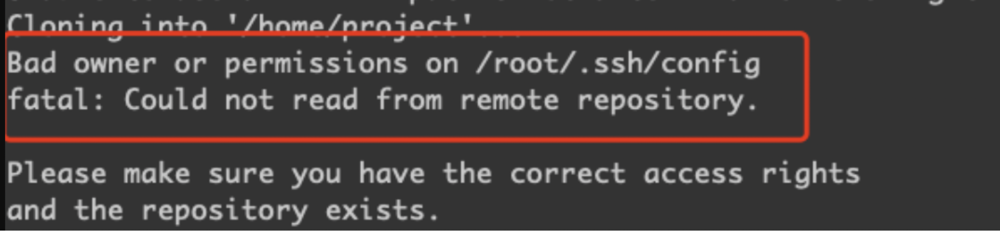
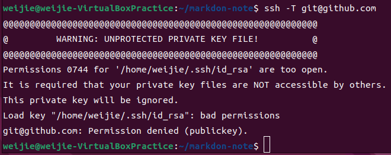

# 注意事項
## git SSH private key 複製到其他電腦可能會遇到的問題

首先是檔案擁有者者問題，如果複製後該當案擁有者非當下家目錄的帳號時候會出現以下錯誤訊息


解決方法是修改檔案擁有者
```bash
sudo chown <使用者帳號>:<使用者帳號> ~/.ssh/sshPrivatKey.rsa
# sshPrivatKey 是自定義名稱
```

根據在 OpenSSH 開源的原始碼當中，如果 SSH Privat Key 除了擁有者(owner)外，如果還有其他權限，像是 group 跟 other 還有其他檔案權限的話會出現，就會出現以下錯誤訊息


解決方法是改變檔案權限讓檔案只有 owner 擁有檔案權限
```bash
sudo chmod 400 ~/.ssh/sshPrivatKey.rsa
```


### 參考
[git ssh 克隆的时候报权限问题](https://www.cnblogs.com/smallidea/p/16304812.html)

# 參考

https://ithelp.ithome.com.tw/articles/10275552?sc=iThelpR
https://cynthiachuang.github.io/Generating-a-Ssh-Key-and-Adding-It-to-the-Github/
https://blog.gtwang.org/linux/linux-ssh-public-key-authentication/